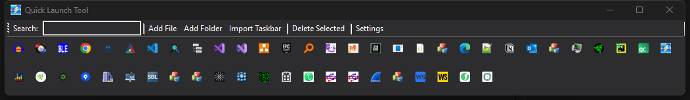

# 快速启动工具 (QuickLaunchTool)

一个轻量级且高效的Windows应用启动器，帮助您快速启动常用应用程序。

## 功能特性

- **快速启动**: 双击启动应用，或右键获取更多选项
- **多语言支持**: 支持7种语言（简体中文、English、日本語、한국어、Français、Deutsch、Español）
- **主题支持**: 浅色和深色主题
- **自定义UI**: 可调整的图标大小（大、中、小）
- **智能搜索**: 实时搜索和过滤应用程序
- **灵活管理**:
  - 添加单个文件
  - 添加整个文件夹（递归扫描）
  - 从Windows任务栏导入
  - 删除应用程序（确认提示）
- **排序选项**: 按名称、修改时间或使用次数排序
- **自动保存**: 应用列表自动保存，下次启动后自动恢复
- **右键菜单**: 右键菜单提供多个选项：
  - 启动
  - 以管理员身份运行
  - 打开文件位置
  - 查看属性
  - 从列表中移除



## 系统要求

- Windows 7 或更高版本
- .NET 6.0 Runtime 或更高版本

## 使用方法

### 添加应用程序

1. **添加文件**: 点击"添加文件"按钮，选择可执行文件
2. **添加文件夹**: 点击"添加文件夹"按钮，扫描并添加文件夹中的所有可执行文件
3. **导入任务栏**: 点击"导入任务栏"按钮，从Windows任务栏导入已固定的应用

### 管理应用程序

- **启动应用**: 双击应用图标即可启动
- **多选应用**: 按住Ctrl并点击可选择多个应用
- **删除选中**: 选择应用后点击"删除选中"按钮
- **右键菜单**: 右键点击应用图标获取更多选项

### 搜索和过滤

- 在顶部搜索框输入文本，实时过滤应用程序

### 设置

点击"设置"按钮配置：
- 语言选择
- 主题（浅色/深色）
- 图标大小
- 窗口位置和透明度
- 应用排序方式
- 窗口始终在前

## 架构设计

### 核心组件

- **MainForm**: 主窗口和应用管理逻辑
- **AppButton**: 单个应用按钮的自定义控件
- **ProcessLauncher**: 应用启动服务
- **FileScanner**: 目录扫描服务
- **ConfigManager**: 配置持久化管理
- **LocalizationManager**: 多语言支持管理
- **ThemeManager**: 主题管理
- **IconExtractor**: 应用图标提取器

### 数据结构

- **AppInfo**: 存储应用信息（名称、路径、图标、使用次数等）
- **AppConfig**: 存储用户配置（主题、语言、窗口状态等）

## 技术细节

- 基于WinForms框架（.NET 6.0）
- 基于资源的多语言本地化系统
- 异步加载图标以提高UI响应速度
- 基于COM的快捷方式解析（任务栏导入）
- 自动图标缓存机制

## 构建和发布

### 从源码构建

```bash
dotnet build
```

### 发布独立可执行文件

创建一个无需安装 .NET 运行时的独立可执行文件：

```bash
dotnet publish -c Release -r win10-x64 --self-contained true -p:PublishSingleFile=true
```

输出文件位于：
```
bin\Release\net6.0-windows\win10-x64\publish\
```

### 发布依赖框架的可执行文件

创建一个需要 .NET 6.0 运行时但体积更小的可执行文件：

```bash
dotnet publish -c Release
```

输出文件位于：
```
bin\Release\net6.0-windows\publish\
```

### 创建安装包

1. 安装 [Inno Setup 6](https://jrsoftware.org/isdl.php)
2. 选择其中一个安装脚本：
   - **QuickLaunchTool.iss**：完整安装包，内置 .NET 运行时（约60MB）
   - **QuickLaunchTool-Lite.iss**：精简安装包，需要用户自行下载 .NET 6.0 运行时（约5MB）
3. 在 Inno Setup Compiler 中打开选择的 `.iss` 文件
4. 点击"Compile"生成安装程序
5. 安装程序将在 `installer\` 目录中生成

## 配置文件

设置保存位置：
```
%APPDATA%\QuickLaunchTool\config.json
```

应用缓存存储在同一配置文件中。

## 文件结构

```
QuickLaunchTool/
├── Forms/              # UI窗体
│   ├── MainForm.cs
│   └── SettingsForm.cs
├── Controls/           # 自定义控件
│   └── AppButton.cs
├── Services/           # 业务逻辑
│   ├── FileScanner.cs
│   ├── ProcessLauncher.cs
│   ├── IconExtractor.cs
│   └── ConfigManager.cs
├── Utils/              # 工具类
│   ├── LocalizationManager.cs
│   ├── ThemeManager.cs
│   ├── CacheManager.cs
│   └── Logger.cs
├── Models/             # 数据模型
│   ├── AppInfo.cs
│   └── AppConfig.cs
└── Resources/          # 本地化资源
    └── Strings.*.resx
```

## 许可证

本项目是开源项目，采用MIT许可证。

## 贡献

欢迎贡献！请随时提交拉取请求或提出bug报告和功能建议。
